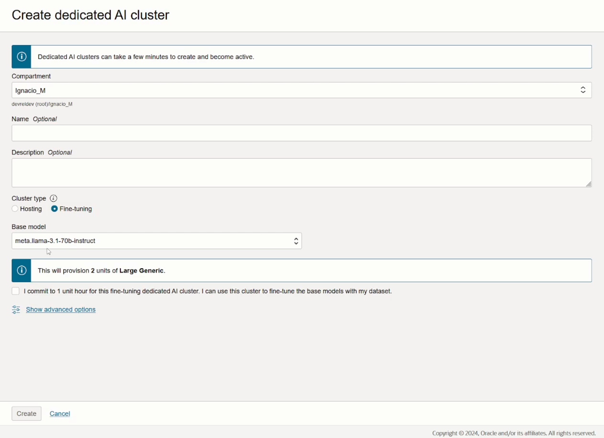

# OCI LLM Finetuning with OCI Generative AI Service

[](https://img.shields.io/badge/license-UPL-green) [](https://sonarcloud.io/dashboard?id=oracle-devrel_oci-genai-finetuning)

## Introduction

Nowadays, when we are working with Large Language Models (LLMs), we typically have the model respond to the training data it has given. However, training these models are very hard; not only do they use **a lot** of resources (which racks up the amount of $$ you need to spend on electricity and hardware), but modifying these behaviors can be quite complex and not-straightforward.

Thankfully, there are some Neural Network implementation optimizations that allow us to do a "smaller training" version of the model with some custom data. This is called **finetuning**.

Typically, finetuning is great when you want to do one of these three things:

- Change the behavior of the base model in some way (e.g. make this base model behave like a specific celebrity)
- Change the interactions with the model (e.g. let the model know we want short/long answers, telling the model how to interact with the user)
- In some cases, adding **vast** amounts of information that the base model didn't have (e.g. giving the model 5,000 prompt-response interactions so it learns about a specific topic very deeply). We would need as much data as possible (like [this question + answering model](https://www.kaggle.com/datasets/stanfordu/stanford-question-answering-dataset)) to do this.

> **Note**: if you're interested in Q&A dataset, check out [this guide's annex](https://github.com/jasperan/llm-discord/blob/main/hands-on/guide.md) I wrote a while ago with a compiled list of the best datasets for this task.

In our case, we will show this demo focusing on option 3: we have lots of prompt-response key-value pairs, and we will modify the behavior of our original `Cohere Light` to hyper-specialize it. With the help of the OCI Generative AI Service, we will create custom models by fine-tuning the base models with our own prompt-response dataset. We can create new custom models or create new versions of existing custom models.

This is the process we will follow to perform finetuning:


## 0. Prerequisites and setup

- Oracle Cloud Infrastructure (OCI) Account
- [Oracle Cloud Infrastructure Documentation - Generative AI Service](https://docs.oracle.com/en-us/iaas/Content/generative-ai/overview.htm)
- [Oracle Cloud Infrastructure Documentation - GenAI Finetuning](https://docs.oracle.com/en-us/iaas/Content/generative-ai/fine-tune-models.htm)
- [Python 3.10](https://www.python.org/downloads/release/python-3100/)
- [Conda](https://conda.io/projects/conda/en/latest/user-guide/install/index.html)

For this demo, we will use the OCI Console to access the service and interact with the Finetuning AI Cluster to perform finetuning operations. (You don't need Python or to install the OCI SDK for Python.)

## 1. Create the training dataset

In our case, we are going to create a finetuned, hyper-knowledgeable version of `Cohere Light` about Finance. Take a look at the introduction if you want to discover [how I found the original dataset.](https://huggingface.co/datasets/gbharti/finance-alpaca/raw/main/Cleaned_date.json)

Since the AI community has a lot of open-source projects and resources, we don't need to manually curate the finance dataset ourselves: we'll reuse someone elses' finance dataset and finetune on top of it.

To download the Finance dataset, run the following command in a terminal:

```bash
curl -O https://huggingface.co/datasets/gbharti/finance-alpaca/raw/main/Cleaned_date.json
```

Now that we have our data, we need to modify it into the expected format by OCI. As per the instructions in the docs, the proper structure for the data is a JSONL file (or JSON Lines) file is a file that contains a new JSON value or object on each line. The file isn't evaluated as a whole, like a regular JSON file, but rather, each line is treated as if it was a separate JSON file. This format lends itself well for storing a set of inputs in JSON format. The OCI Generative AI service accepts a JSONL file for fine-tuning custom models in the following format:

```json
{"prompt": "<first prompt>", "completion": "<expected completion given first prompt>"}
{"prompt": "<second prompt>", "completion": "<expected completion given second prompt>"}
```

I have created a script to perform this conversion. To run the converter, execute the following command:

```bash
cd scripts/
python preprocess_json.py
```

> **Note**: make sure you have your `data/` directory with the `finance_data.json` file within it.

Now that we have our training dataset, we're ready for the next step.

## 2. Add dataset to Object Storage bucket

After creating a Bucket in our OCI tenancy:


We can now upload objects into it - in our case, we put our JSONL-formatted data into this bucket:


## 3. Create a fine-tuning dedicated AI cluster

1. In the navigation bar of the Console, choose a region that hosts Generative AI, for example, US Midwest (Chicago). If you don't know which region to choose, see Regions with Generative AI.
2. Open the navigation menu and click **Analytics & AI**. Under **AI Services**, click **Generative AI**.
3. In the left navigation, choose a compartment that you have permission to work in.
4. Click **Dedicated AI clusters**.
5. Click **Create** dedicated AI cluster.
6. Select a compartment to create the dedicated AI cluster in. The default compartment is the one you selected in step 3, but you can select any compartment that you have permission to work in.

For **Cluster** type, click Fine-tuning.

For **Base** model, choose the base model for the custom model that you want to fine-tune on this cluster:

- Cohere.command: Provisions two Large Cohere units.
- Cohere.command-light: Provisions two Small Cohere units.



> **Note**: When you create a dedicated AI cluster for fine-tuning, two units are created for the base model that you choose. Hosting a model requires at least one unit and fine-tuning requires two units, because fine-tuning a model requires more GPUs than hosting a model. The number of units for fine-tuning is hard-coded to two and you can't change it. You can use the same fine-tuning cluster to fine-tune several models.


## 4. Create a new custom model on the fine-tuning dedicated AI cluster


With our finetuning cluster, let's create a custom model. There are two training methods for finetuning available:

- T-Few: recommended for small datasets (100,000- samples). Also, the most typical use case here is finetuning the base model to follow a different prompt format, or follow different instructions.
- **Vanilla**: for large datasets (100,000-1M+ samples). Usually applied for complicated semantical understanding improvement (e.g. enhancing the model's understanding about a topic). This is the recommended type of training for our finance example.

> **Note**: Using small datasets for the Vanilla method might cause overfitting. Overfitting happens when the trained model gives great results for the training data, but can't generalize outputs for unseen data. (Meaning, it didn't really learn a lot, it just hyperspecialized for the test data, but can't transfer that knowledge to all data in the dataset).


Finally, after we select our dataset from Object Storage, we can create our model. This will take a while, as the model will be trained on the dataset we provided, in our case, containing 67.000+ prompt-response completions. Also, we've decided to run the finetuning cluster for 5 finetuning epochs (the more epochs you specify, the more the LLM will learn and reinforce its knowledge about the content; but it will also take longer).


After creation, we can observe the model's performance here:


## 5. Create endpoint for the custom model

In order to consume our newly created model, we need to create a hosting dedicated AI cluster. This will expose the model as if it was an API - this means, we're using OCI as an API server that runs inference on our finetuned model.

> **Note**: take a look at [these docs](https://docs.oracle.com/en-us/iaas/api/#/en/generative-ai-inference/20231130/) to learn about invoking the model through the Inference API.

The first time you run the creation of an endpoint, it will check whether you already have a dedicated hosting AI Cluster created. If you don't, it will prompt you to create one:


After creation, we can proceed to create the endpoint:


> **Note**: you can enable or disable a content moderation filter. This is useful if you want to filter out any potentially harmful or sensitive content from your model. Also, you'll be able to see how many requests left you have available in your hosting endpoint by looking at its remaining capacity.


We're now ready to interact with the model, either through the endpoint, or via the OCI GenAI Playground.

## 6. Run the custom model in the playground

We can click the following button to launch it in the playground:


Once we're in the playground, we can also modify the model's hyperparameters dynamically with the menu in the right side of the screen. [Have a look at these docs](https://docs.oracle.com/en-us/iaas/Content/generative-ai/concepts.htm) if you want to learn more about all customization options for the model.

After selecting the newly created finance_expert (finetuned version of Cohere Light with a finetuned Q&A dataset), we can start making generations with our new LLM:


If you're wondering why the text is highlighted, it's due to the likelihoods hyperparameters:


We've successfully finetuned a model to adapt a new behavior to its knowledge base!

## Demo

TODO

## Tutorial

TODO

## Physical Architecture


## Contributing

This project is open source.  Please submit your contributions by forking this repository and submitting a pull request!  Oracle appreciates any contributions that are made by the open source community.

## License

Copyright (c) 2022 Oracle and/or its affiliates.

Licensed under the Universal Permissive License (UPL), Version 1.0.

See [LICENSE](LICENSE) for more details.

ORACLE AND ITS AFFILIATES DO NOT PROVIDE ANY WARRANTY WHATSOEVER, EXPRESS OR IMPLIED, FOR ANY SOFTWARE, MATERIAL OR CONTENT OF ANY KIND CONTAINED OR PRODUCED WITHIN THIS REPOSITORY, AND IN PARTICULAR SPECIFICALLY DISCLAIM ANY AND ALL IMPLIED WARRANTIES OF TITLE, NON-INFRINGEMENT, MERCHANTABILITY, AND FITNESS FOR A PARTICULAR PURPOSE.  FURTHERMORE, ORACLE AND ITS AFFILIATES DO NOT REPRESENT THAT ANY CUSTOMARY SECURITY REVIEW HAS BEEN PERFORMED WITH RESPECT TO ANY SOFTWARE, MATERIAL OR CONTENT CONTAINED OR PRODUCED WITHIN THIS REPOSITORY. IN ADDITION, AND WITHOUT LIMITING THE FOREGOING, THIRD PARTIES MAY HAVE POSTED SOFTWARE, MATERIAL OR CONTENT TO THIS REPOSITORY WITHOUT ANY REVIEW. USE AT YOUR OWN RISK.
